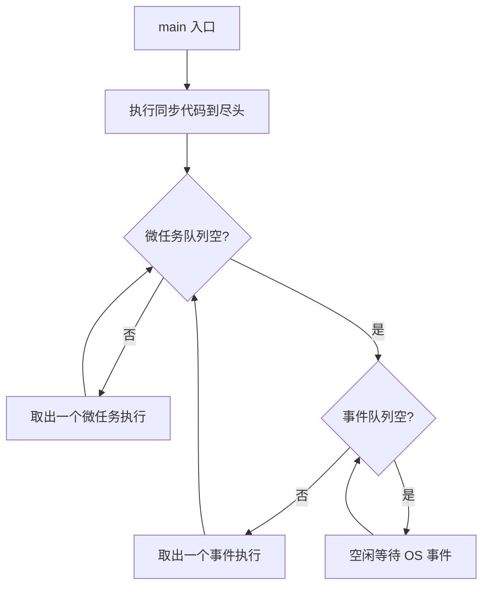

# 第 8 章 事件循环原理（核心）

> 这一章是整个教程的心脏。看懂这里，前面讲的 Future/async/Stream 的所有"奇怪行为"都会变成必然。

## 事件循环是什么

Dart 每个 **Isolate** 里都有一个事件循环（event loop）。简化模型：



记住两条规则：

1. **必须先把同步代码跑完**，才会去检查队列
2. **每跑一个事件前，会把微任务队列全部清空**

## 两个队列

| 队列 | 如何进入 | 谁来用 | 优先级 |
|------|---------|--------|--------|
| 微任务（microtask queue） | `scheduleMicrotask(fn)`、Future 回调(**部分情况**) | Dart 内部：Future 的 `.then` 立即回调 | 高（同批次优先清空） |
| 事件（event queue） | `Future(fn)`、`Future.delayed`、Timer、IO、UI 手势 | 业务异步工作 | 低 |

**一句话**：微任务是 "立刻在本轮结束前做完"；事件是 "下一轮再做"。

## 经典题目：猜输出顺序

```dart
import 'dart:async';

void main() {
  print('1 sync');
  scheduleMicrotask(() => print('2 micro-a'));

  Future(() => print('3 event-a')).then((_) {
    print('4 then-after-event-a');
    scheduleMicrotask(() => print('5 micro-inside-then'));
  });

  Future.microtask(() => print('6 micro-b'));
  Future(() => print('7 event-b'));

  print('8 sync');
}
```

正确输出：

```text
1 sync
8 sync
2 micro-a
6 micro-b
3 event-a
4 then-after-event-a
5 micro-inside-then
7 event-b
```

逐步拆解：
1. 同步部分先跑完：`1`、`8`
2. 同步结束，事件循环开始：**先清空微任务队列** → `2`、`6`
3. 微任务空了，取一个事件：`3 event-a`
4. 这个事件完成后触发 `.then`（`.then` 的回调通常作为 **微任务** 入队）
5. 下一步"跑事件前先清微任务" → `4`、`5`
6. 微任务空了，取下一个事件：`7 event-b`

## 最重要的一条规则

> **一个任务（无论微任务还是事件）运行期间，事件循环不会被打断。**

这意味着：
- 你在 `.then` 回调里写个 `while(true)` 死循环，**整个 App 冻死**
- 单 Isolate 里**没有"抢占式调度"**，只有"协作式"

这是 Dart 异步的底线：**谁占着线程谁说了算，除非自愿 `await` 或函数结束**。

## 为什么 `Future.value(x).then(...)` 里的 then 也是异步的

```dart
print('A');
Future.value(1).then((_) => print('B'));
print('C');
// 输出: A C B
```

即使 Future 的值**已经就绪**，`.then` 也不会同步执行。Dart 规范要求 `.then` 至少**异步运行**（作为微任务），以避免"有时同步、有时异步"带来的不可预测性。这个特性叫做 **"异步边界的一致性"**。

## `Future()` vs `Future.microtask()` vs `scheduleMicrotask()`

```dart
Future(() => print('event'));           // 进事件队列
Future.microtask(() => print('micro')); // 进微任务队列
scheduleMicrotask(() => print('micro')); // 进微任务队列（更底层的 API）
```

`Future.microtask` 其实就是 `scheduleMicrotask` 的 Future 包装。

## Timer 与 Future.delayed

```dart
Timer(Duration.zero, () => print('timer'));
Future(() => print('future'));
scheduleMicrotask(() => print('micro'));

// 输出: micro -> future -> timer
```

注意 `Timer(Duration.zero)` 并不等于 "立即"——它还是进**事件队列**，并且在某些实现里优先级比 `Future(() => ...)` 略低。**微任务永远先于定时器**。

## 图解一次事件循环

```mermaid
sequenceDiagram
    participant Sync as 同步代码
    participant MQ as 微任务队列
    participant EQ as 事件队列
    participant Loop as 事件循环

    Sync->>Sync: 执行所有同步语句
    Sync->>Loop: 同步结束
    Loop->>MQ: 取出全部微任务
    MQ-->>Loop: 逐个执行(可能再塞入新的微任务, 也要执行)
    Loop->>EQ: 微任务空了, 取一个事件
    EQ-->>Loop: 执行该事件
    Loop->>MQ: 再清空微任务
    Note over Loop: 循环上面两步, 直到都空
```

## 为什么过度使用微任务会卡 UI

```dart
void flood() {
  scheduleMicrotask(flood); // 永远没机会跑事件
}
```

调用 `flood()` 后，微任务队列**永远非空**，事件循环永远卡在"清微任务"这一步，事件队列（包含 **UI 渲染帧、手势**）永远轮不到。App 表面没崩，但彻底冻死。

**教训**：微任务要节制，别递归塞。

## 验证代码

`lib/pure_dart/chapter_08.dart` 是本章最重要的脚本，**一定要跑一遍**，观察输出和文档描述是否完全一致。

```bash
dart run lib/pure_dart/chapter_08.dart
```

## 小结

- Dart 每个 Isolate 有**一个事件循环、两个队列**
- **同步 > 微任务 > 事件**，且事件之间每次都先清空微任务
- 任务执行期间不会被打断
- 微任务适合"顺着链接往下接的小活"，滥用会饿死事件

## 练习题

1. 把上面那个经典题不看答案，自己在纸上写一遍输出再运行验证。
2. 写一段代码：`main` 里既有网络请求（`Future.delayed`），又有微任务，理清楚打印顺序。
3. 把 `flood()` 递归改成"每 100 次让一次事件"——怎么做到的？（提示：`await Future.value()`）

下一章 → [第 9 章 Zone 与错误](09_zone_and_errors.md)。
