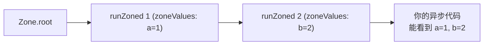

# 第 9 章 Zone 与全局错误处理

## 为什么需要 Zone

异步函数抛出的异常很容易"丢"掉：

```dart
void main() {
  Future(() => throw StateError('boom')); // 没 await, 没 catchError
  print('main 继续');
}
```

这个异常没被任何地方 catch。Dart 运行时会把它归类为 **"未处理的异步异常"**，打印一条错误到控制台但不会终止程序。

在 Flutter 里，这会变成 Red Screen 或者"静默失败"。我们需要一个 **全局兜底** 机制——这就是 **Zone**。

## Zone 是什么

Zone 可以理解为"一个执行上下文/沙箱"：
- 所有异步任务都在某个 Zone 里运行
- Zone 可以拦截该沙箱内所有未处理的异常
- Zone 可以改写 `print` 的行为
- Zone 可以携带自己的数据（类似线程局部存储）

`Zone.current` 始终指向当前运行的 Zone；根 Zone 叫 `Zone.root`。

## runZonedGuarded：捕获所有未处理异常

```dart
import 'dart:async';

void main() {
  runZonedGuarded(() {
    // 被这个 zone 包裹的所有异步代码，如果有未处理异常都会走到 onError
    Future(() => throw StateError('boom'));
    Future.delayed(const Duration(milliseconds: 100),
        () => throw StateError('later'));
  }, (error, stack) {
    // 全局兜底
    print('捕获到未处理异常: $error');
  });
}
```

Flutter 官方推荐的 App 入口模板：

```dart
void main() {
  runZonedGuarded(() {
    // Flutter 的错误
    FlutterError.onError = (details) {
      // 可以上报到 Sentry
    };
    runApp(const MyApp());
  }, (error, stack) {
    // 捕获非 Flutter 的未处理异常 (包括异步)
  });
}
```

两件事要同时做：
- **`FlutterError.onError`**：捕获 Flutter 框架层面的错误（build、layout、render 里的异常）
- **`runZonedGuarded`**：捕获 Dart 侧的未处理异常

## 自定义 Zone：拦截 print

```dart
runZoned(() {
  print('hello');
}, zoneSpecification: ZoneSpecification(
  print: (self, parent, zone, line) {
    parent.print(zone, '[zone] $line'); // 所有 print 自动加前缀
  },
));
// 输出: [zone] hello
```

你还可以拦截：
- `handleUncaughtError`
- `scheduleMicrotask`
- `createTimer`
- `fork`

**典型用途**：测试时伪造时间、监控所有微任务、给日志加 traceId。

## Zone 携带数据

```dart
runZoned(() {
  print('traceId=${Zone.current['traceId']}');
}, zoneValues: {'traceId': 'abc-123'});
```

这条数据会沿着所有异步调用**自动传递**——即使中间经过了多次 `await` / `then`，Zone 都是同一个。

这是 Dart 实现"异步上下文"的方式（类比 Java 的 MDC、JS 的 AsyncLocalStorage）。

## Zone 之间的关系



- Zone 是嵌套的
- 找 zoneValue 会顺着父 Zone 往上找
- 一个异步任务出错时，errorHandler 会在 **定义这个任务所在的 Zone** 上触发

## 错误传播的完整链

一个异步异常在 Dart 里的传播顺序：

1. 有 `try/catch` / `.catchError` 拦截？→ 停止传播
2. 没有 → 触发当前 Zone 的 `handleUncaughtError`
3. Zone 没处理 → 冒泡到父 Zone
4. 最终到 `Zone.root` → 打印到控制台，程序继续（Dart VM 不会因此崩溃）

## 小结

- 所有 Dart 异步代码都在 **Zone** 里跑
- `runZonedGuarded` 是给 App 做全局兜底的标准姿势
- `ZoneSpecification` 可以拦截 print/错误/微任务
- `zoneValues` 沿异步链传递，天然是异步版 "thread local"

## 练习题

1. 包一个 `runZonedGuarded`，故意在里面抛 3 个异步异常，验证都能被捕获。
2. 写一个自定义 Zone，把所有 `print` 加前缀 `[DEBUG]`。
3. 用 `zoneValues` 存一个 `userId`，在深层异步里读到。

下一章进入"真并行" → [第 10 章 Isolate](10_isolate.md)。
