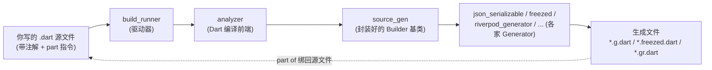

# 第 0 章 总览: 为什么 Flutter 需要代码生成

## 目标

- 理解 Dart/Flutter 里 "代码生成 (code generation)" 是在解决什么问题。
- 认识工具链里几个关键名字: `build_runner` / `source_gen` / `analyzer` / `part 指令`。
- 学会两个最常用命令: `dart run build_runner build` 和 `dart run build_runner watch`。

## 一句话解释

> **代码生成 = 把"重复、机械、根据现有代码能推理出来"的样板代码, 交给工具去写, 而不是你手敲。**

Dart 没有运行时反射 (dart:mirrors 在 Flutter 里被禁用), 所以 Java / Kotlin 里那种 "运行时读注解" 的玩法在 Flutter 里行不通。

Flutter/Dart 的替代方案是: **编译前** 扫一遍你的源码, 根据你打的注解, **额外生成** 一些 Dart 文件, 和你手写的代码一起参与编译。

## 典型场景

| 场景 | 没有 codegen 时你得写 | 有 codegen 后你只需要写 | 工具 |
|------|---------------------|----------------------|------|
| JSON 解析 | 手写 `fromJson`/`toJson`, 字段一多就噩梦 | 加 `@JsonSerializable()` | `json_serializable` |
| 不可变 data class | 手写 `copyWith`/`==`/`hashCode`/`toString`, 字段一改全改 | 加 `@freezed` | `freezed` |
| Riverpod Provider | 挑选 5 种 Provider, 手写类型 | 加 `@riverpod` | `riverpod_generator` |
| HTTP 客户端 | 手写 dio 调用, 编码参数, 解析响应 | 加 `@RestApi()` + 接口方法 | `retrofit` |
| 路由 | 字符串路由名, 不类型安全 | 加 `@AutoRouterConfig` | `auto_route` |
| 依赖注入 | 手写 `GetIt.register` 一大串 | 加 `@injectable` | `injectable` |
| 数据库 (SQLite) | 手拼 SQL 字符串 | 用 Dart 声明表, 生成类型安全查询 | `drift` |
| 资源引用 | `Image.asset('assets/images/logo.png')` | `Image.asset(Assets.images.logo)` | `flutter_gen` |
| 国际化 | 手维护 Map<String, String> | 写 ARB, 生成 `AppLocalizations` | `gen_l10n` |
| 测试 Mock | 手写一大堆 FakeXxx | 加 `@GenerateMocks([...])` | `mockito` |

凡是你感觉 "这段代码其实是根据那段代码推出来的", 都是 codegen 的应用场景。

## 工具链全景



**关键分工**:

- **`analyzer`**: Dart 官方的编译前端, 把源码读成一棵树 (AST) 和一张元素表 (`LibraryElement`)。
- **`source_gen`**: 官方出的封装, 帮你处理 "找到所有带 `@Foo` 注解的类, 对每个类调用你的函数, 把返回值当代码写出去" 这种套路。
- **各家 Generator**: 用 `source_gen` 提供的基类实现具体生成逻辑。
- **`build_runner`**: 调度器。它读 `build.yaml`, 决定先跑谁后跑谁, 缓存中间产物, 支持 `watch` 模式。

## part 指令: 手写代码 + 生成代码的桥梁

大多数生成文件都用 **part / part of** 机制, 典型形式:

```dart
// lib/user.dart  (你写的)
import 'package:json_annotation/json_annotation.dart';

part 'user.g.dart';        // <- 告诉 Dart: user.g.dart 是我这个库的一部分

@JsonSerializable()
class User {
  User({required this.name});
  final String name;

  factory User.fromJson(Map<String, dynamic> json) => _$UserFromJson(json);
  Map<String, dynamic> toJson() => _$UserToJson(this);
}
```

```dart
// lib/user.g.dart  (build_runner 生成的, 自动带 "GENERATED CODE - DO NOT MODIFY")
part of 'user.dart';

User _$UserFromJson(Map<String, dynamic> json) => User(name: json['name'] as String);
Map<String, dynamic> _$UserToJson(User instance) => <String, dynamic>{'name': instance.name};
```

- 你在 `user.dart` 里 **调用** `_$UserFromJson`/`_$UserToJson`, 它们是生成文件里 **定义** 的。
- 两个文件通过 `part / part of` 变成 **同一个 Dart 库**, 所以能互访私有成员 (以 `_` 开头的名字)。
- 没跑 `build_runner` 之前, `.g.dart` 不存在, 你会看到一堆编译错误—这是正常的。

## 两个命令

### 一次性生成

```bash
dart run build_runner build --delete-conflicting-outputs
```

- `build`: 跑一次, 跑完就结束。
- `--delete-conflicting-outputs`: 如果旧的生成文件和新的产物冲突, 直接删掉。**强烈建议一直加上**。

### 持续监听

```bash
dart run build_runner watch --delete-conflicting-outputs
```

- 开发时推荐。它会监听你的文件, 一改就重新生成对应 part 文件。
- 开着这个终端, 你写代码时生成文件会自动更新, 编辑器就不会报 "未定义 `_$XxxFromJson`" 了。

## 分类: 同一类问题的几种流派

| 流派 | 特点 | 代表 |
|------|------|------|
| **字段级 codegen** | 针对一个类/一个方法生成 | `json_serializable`, `freezed`, mockito |
| **库级 codegen** | 扫描整个项目, 汇总信息再生成 | `injectable` (收集所有 `@injectable` 生成一个 `configureDependencies()`), `auto_route` |
| **DSL codegen** | 你提供 "声明文件", 生成 Dart 类 | `drift` (`.drift` SQL 文件), Flutter l10n (ARB 文件) |
| **宏 (macros)** | Dart 3.5+ 新机制, 编译器内置, **无需 build_runner** | `@JsonCodable`, 见第 15 章 |

这门课 0–14 章讲的是前三类 (基于 `build_runner`), 第 15 章讨论第四类。

## 版本和环境

| 项 | 版本 |
|----|------|
| Flutter | 3.38 或更新 |
| Dart SDK | `^3.5.0` 即可, 第 15 章要 `^3.5` 以上 |
| 所有 generator | 见 `pubspec.yaml` |

## 常见坑 (全书都会复现)

1. **先 `pub get`, 再 `build_runner build`**: 顺序反了会报 "找不到 builder"。
2. **编辑 `.g.dart`/`.freezed.dart` 毫无意义**: 下次生成时你改的会被抹掉。
3. **看到 "Concurrent modification during iteration" 之类的神秘错误, 先 `--delete-conflicting-outputs`**。
4. **analysis_options.yaml 记得排除生成文件**, 不然 lint 的提示会挡掉真正的错误 (本项目已配置好)。
5. **VS Code 偶尔分析器没跟上**: 重启 Dart analysis server 即可 (命令面板: `Restart Analysis Server`)。

## 练习

1. 在你电脑上: `cd codegen_tutorial && flutter pub get && dart run build_runner build --delete-conflicting-outputs`。观察 terminal 输出里列的各个 builder 名字。
2. 打开 `codegen_tutorial/packages/my_generator/` 目录, 只看一眼, 有个印象这就是一个能生成代码的 Dart 包 (第 2 章会细讲)。
3. 思考: 你现在业务里手敲过哪些 "感觉很机械, 能根据别的代码推出来" 的模板代码? 它们可能对应哪类 codegen 工具?
