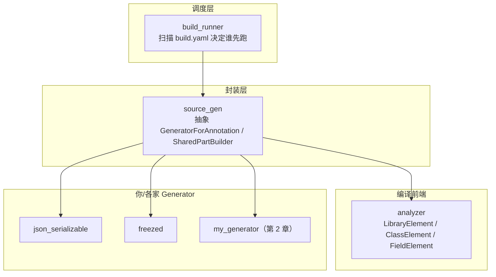

# 第 1 章 build_runner 内部原理

## 目标

搞清楚从 `dart run build_runner build` 到 `*.g.dart` 出现在硬盘上, 中间到底发生了什么。

## 三层结构



## 核心概念

### 1. Builder: 真正执行生成的对象

```dart
abstract class Builder {
  Map<String, List<String>> get buildExtensions;
  Future<void> build(BuildStep buildStep);
}
```

- `buildExtensions`: "我拿什么扩展名的输入, 生成什么扩展名的输出"。
  例如 `{'.dart': ['.g.part']}` = 每个 `.dart` 可能产出一个 `.g.part`。
- `build(BuildStep)`: 一次具体的构建。`BuildStep` 里能读当前 asset、读其他 asset、写输出。

### 2. BuildStep: 一次构建的"上下文"

重要能力:

- `buildStep.inputId` — 当前被处理的文件 ID。
- `buildStep.resolver.libraryFor(inputId)` — 拿到解析后的 `LibraryElement`, 就能"反射"这个文件里的所有类、方法、注解。
- `buildStep.writeAsString(outputId, content)` — 写出生成文件。

### 3. source_gen: 常用套路的封装

自己从零实现 `Builder` 要处理 "怎么找到打 `@Foo` 的类"、"多个生成器怎么合并到一个 .g.dart" 之类的琐事。
`source_gen` 封装了两样最常用的:

- **`GeneratorForAnnotation<T>`**: 自动过滤掉没有 `@T` 注解的元素, 你只关心单个 element 怎么生成字符串。
- **`SharedPartBuilder`**: 多个 Generator 的输出, 合并到**同一个** `xxx.g.dart` 里 (这就是为什么 `@JsonSerializable` 和 `@CopyWith` 可以都输出到同一个 `.g.dart`)。

### 4. LibraryElement: analyzer 的产物

```dart
final lib = await buildStep.resolver.libraryFor(buildStep.inputId);
for (final cls in lib.classes) {
  print(cls.name);         // 类名
  for (final f in cls.fields) {
    print('${f.name}: ${f.type}');
  }
}
```

你几乎可以拿到源码里的一切元信息 (类、字段、方法签名、注解的参数、文档注释...)。
`source_gen` 的 `GeneratorForAnnotation<T>` 会帮你筛出带 `@T` 的元素再交给你。

### 5. part 文件 vs 独立文件

| 类型 | 扩展名惯例 | 本质 |
|------|-----------|------|
| part 片段 | `.g.part` (临时) | source_gen 的各 generator 各自产物; 最后合并 |
| part 文件 | `.g.dart`, `.freezed.dart` | 源码里写 `part 'xxx.g.dart';` 来绑定 |
| 独立文件 | `.gr.dart` (auto_route) / drift 的 db 文件 / `l10n/generated/*` | 不用 part, 源码里 `import` 即可 |

## `build.yaml`: 调度规则

一个典型的 `build.yaml`:

```yaml
targets:
  $default:
    builders:
      json_serializable:
        options:
          explicit_to_json: true
```

它的作用:

- 开关 builder (某些 builder 默认关, 要你显式启用)。
- 调整 options (每家 generator 自己定义)。
- 控制输入输出路径 (一般不用改)。

`build_runner` 启动时, 读当前 package 和依赖里 **所有 package 下的 `build.yaml`**, 汇总得到一张 "builder DAG", 再按依赖顺序跑。
例如 `freezed` 的产物是 `@JsonSerializable` 的输入 (经常一起用), 所以 `freezed` 会先跑, 然后 `json_serializable` 再跑。这个顺序由 `required_inputs` / `runs_before` 这些键控制, 通常不需要你自己写, 各家库已经配好了。

## 命令行体验

### build

```bash
dart run build_runner build --delete-conflicting-outputs
```

典型输出 (片段):

```
[INFO] Generating build script...
[INFO] Running build...
[INFO] Running build completed, took 8.2s

[INFO] Caching finalized dependency graph...
[INFO] Caching finalized dependency graph completed, took 31ms

[INFO] Succeeded after 8.3s with 23 outputs
```

23 outputs 就是生成了 23 份文件。

### watch

```bash
dart run build_runner watch --delete-conflicting-outputs
```

它会启动一个守护进程, 监听文件变化:

```
[INFO] Serving on http://localhost:8080
[INFO] Starting initial build...
[INFO] Running build completed, took 2.1s
[INFO] Build completed, took 0ms
[INFO] Watching for file changes...
```

修改一个 `@JsonSerializable` 的类, 秒级看到对应 `.g.dart` 被刷新。

### clean

```bash
dart run build_runner clean
```

清空 `.dart_tool/build/` 缓存。不常用, 遇到 "生成代码貌似没更新" 时可以试。

## 增量构建

`build_runner` 会记录每个 **输出 → 输入** 的依赖关系, 存到 `.dart_tool/build/`。再次运行时:

1. 扫描哪些输入文件 hash 变了;
2. 只让 "输入变了" 的 builder 跑一次;
3. 其他全部走缓存。

**推论**: 第一次 build 慢, 后续 build 通常很快。如果你频繁 `flutter clean`, 会把 `.dart_tool` 一起删, 下次就又慢一次。

## 常见错误与解释

| 报错 | 含义 | 处理 |
|------|------|------|
| `Could not find package "xxx_generator"` | 忘了装 dev_dependency | `flutter pub add dev:xxx_generator` |
| `Target $default:xxx_generator has additional unknown rules` | `build.yaml` 写错键 | 对照官方文档 |
| `Concurrent modification during iteration: ...` | 编辑生成文件时被 watcher 读到 | 重跑 build |
| `... has conflicts with the following outputs` | 旧产物和新产物重复 | 加 `--delete-conflicting-outputs` |
| `Failed to snapshot build script` | 某个 generator 版本和 analyzer 不兼容 | 更新/回退版本 |

## 一张对照表: "谁在什么阶段做什么事"

| 阶段 | 干什么 | 使用的工具 |
|------|-------|-----------|
| 1. 写源码 | 打 `@Annotation` + `part 'x.g.dart';` | (你的手) |
| 2. `pub get` | 下载 builder 到 pub 缓存 | pub |
| 3. `build_runner build` 启动 | 读 build.yaml 生成"构建脚本" | build_runner |
| 4. 扫描 assets | 找到所有 `.dart` 文件 | build_runner |
| 5. 解析源码 | 把每个 lib 变成 `LibraryElement` 树 | analyzer |
| 6. 执行 generator | 对每个元素调用 `generateForAnnotatedElement` | source_gen + 各家 |
| 7. 合并输出 | 多个 generator 的 `.g.part` 合并成一个 `.g.dart` | source_gen 的 `combining_builder` |
| 8. 写文件 | 写到源码目录 | build_runner |
| 9. 编译 | `.dart` + `.g.dart` 一起走正常 Dart 编译 | dart compile / flutter build |

## 练习

1. 跑一次 `dart run build_runner build -v` (加 verbose), 在输出里找找 "json_serializable"、"freezed"、"riverpod_generator" 的字样, 理解调度顺序。
2. 打开 `.dart_tool/build/generated/`, 里面就是中间产物缓存。随便挑一个 `.g.part` 打开看, 和最终的 `.g.dart` 对比。
3. 思考: 为什么 Flutter 选择了 "编译前生成静态 Dart 文件" 的方案, 而不是像 Java Spring 那样运行时反射? (提示: AOT / tree-shaking / Flutter 禁用 dart:mirrors)
