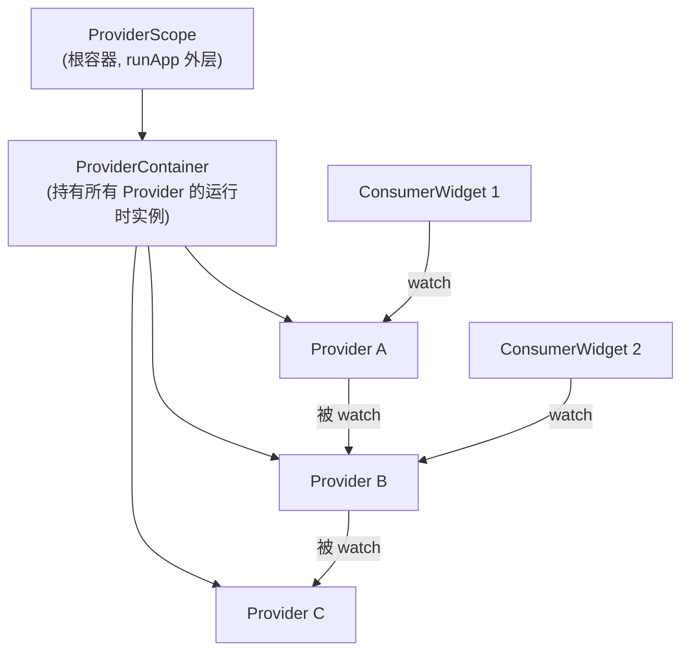

# 第 0 章 总览：为什么是 Riverpod

## 一句话定位

> **Riverpod 是一个 "响应式缓存 + 依赖注入" 框架**。

说两件事：
1. 帮你把"数据获取 + 数据缓存 + 数据在 UI 里用"这条链路写得声明式、可测试
2. 它不只是"状态管理"，更像一个**轻量依赖注入容器**，所有数据来源（Repository、服务、配置）都能作为 Provider 被注入和替换

## 和其他方案对比

| 方案 | 核心思想 | 痛点 |
|-----|---------|------|
| `setState` | 最原始的 Flutter 方案 | 状态散落、难跨页面共享、难测试 |
| `provider` | InheritedWidget 的语法糖 | context 依赖、编译期不安全、嵌套多 |
| `Bloc` / `Cubit` | 事件 → 状态，严格单向数据流 | 样板代码多、小项目过度设计 |
| `GetX` | 大一统，反应式变量 | 黑盒化严重、架构建议混乱 |
| **`Riverpod`** | 全局不依赖 context、纯编译期类型安全、依赖图自动管理 | 概念初看多、需要心智模型切换 |

Riverpod 的作者也是 `provider` 的作者 Rémi Rousselet。Riverpod 是他总结 Provider 使用痛点后的重写版，目标是：

- **不依赖 `BuildContext`**（在 `main` 里、测试里、Dart 脚本里都能拿到 Provider）
- **编译期类型安全**（忘读错类型 = 编译报错）
- **自动依赖图**（一个 Provider 改了，依赖它的其他 Provider 和 Widget 自动更新；不依赖的不会被重建）
- **天然支持异步**（Future / Stream 是一等公民，加载/错误/数据三态开箱即用）

## 核心心智模型



记住 3 个名词，其它都是派生：

1. **Provider**：定义一个值怎么算出来（可以是同步、异步、Stream、可变状态）
2. **Ref**：Provider 的"上下文"。用 `ref.watch(...)` 读别的 Provider 的值并订阅更新
3. **ProviderScope**：把整个 Provider 容器装进 Widget 树，`runApp` 外层必有

## 你会学到什么

本教程从 **完全手写** Provider 开始，把每种 Provider 的本质讲清楚：

- `Provider<T>` —— 同步计算、缓存
- `NotifierProvider<N, T>` —— 可变状态（类似 Bloc 的 cubit）
- `FutureProvider<T>` / `AsyncNotifierProvider<N, T>` —— 异步数据
- `StreamProvider<T>` / `StreamNotifierProvider<N, T>` —— 实时流数据

理解之后（前 8 章），再切到现代推荐写法：**代码生成 `@riverpod`**。编译器帮你推断用哪种 Provider、帮你写样板、还支持 stateful hot reload。

## 关于版本

本教程使用：

- `flutter_riverpod: ^3.3.1`（v3 大变动后统一了 `Ref` 类型）
- `riverpod_annotation: ^4.0.2`
- `riverpod_generator: ^4.0.3`

注意：Riverpod 1.x / 2.x 的很多教程和 Stack Overflow 答案**API 已过时**，比如 `StateNotifierProvider`、`ChangeNotifierProvider` 在 v3 已被标记 legacy。本教程只讲现代 API。

## 如何运行

参考仓库根 [`README.md`](../README.md)：

```bash
cd riverpod_tutorial
flutter pub get
dart run build_runner watch --delete-conflicting-outputs   # 第 9 章开始需要
flutter run
```

准备好了？→ [第 1 章](01_first_provider.md) 写第一个 Provider。
