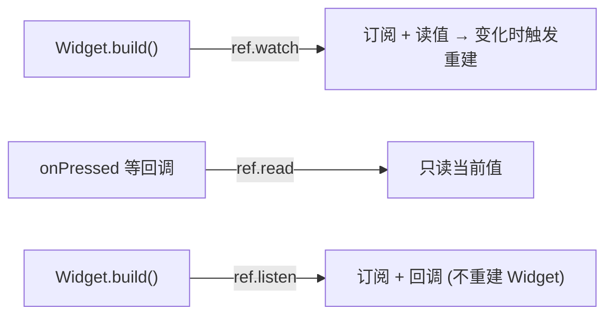

# 第 2 章 ref 三件套：watch / read / listen

`ref` 有三个常用方法，语义完全不同。弄混它们是新手最常见的 bug 源头。

## 一张对照表先记住

| 方法 | 行为 | 会触发重建吗 | 适用场景 |
|-----|------|--------------|---------|
| `ref.watch(p)` | **读当前值 + 订阅后续变化** | 是 | **几乎所有在 `build` 里读 Provider 的场景** |
| `ref.read(p)` | **读当前值，不订阅** | 否 | 按钮回调里用一次、`initState` 里读一次 |
| `ref.listen(p, cb)` | **订阅变化 + 触发回调**（但不直接把值用到当前 build） | 否（不重建当前 Widget，只跑 cb） | 弹 SnackBar、导航、日志 |

## watch：90% 的场景用它

```dart
class Counter extends ConsumerWidget {
  @override
  Widget build(BuildContext context, WidgetRef ref) {
    final count = ref.watch(counterProvider);
    return Text('$count');
  }
}
```

只要 `counterProvider` 的状态变化，这个 Widget 就会重建。**这是响应式 UI 的核心**。

规则：
- `ref.watch` **只能在 `build`（或 `Notifier.build`）里调用**
- 不要放在 `onPressed` 等回调里——你会发现它每次点击都订阅一次
- 不要放在 `initState` 里——生命周期还没走到订阅阶段

## read：按钮回调里用

```dart
ElevatedButton(
  onPressed: () {
    // 从按钮回调里调用一个方法：我不关心值变了要不要刷新 UI，只想拿来用一次
    ref.read(counterProvider.notifier).increment();
  },
  child: const Text('+1'),
);
```

`ref.read(counterProvider)` 拿的是当前值；`ref.read(counterProvider.notifier)` 拿的是 **Notifier 实例**（用于调方法）。区别：

```dart
final count = ref.read(counterProvider);              // int, 当前值
final notifier = ref.read(counterProvider.notifier);  // CounterNotifier 实例
notifier.increment();
```

## listen：副作用（导航、SnackBar）

```dart
class SignInPage extends ConsumerWidget {
  @override
  Widget build(BuildContext context, WidgetRef ref) {
    // 当 authProvider 变化时, 执行一次回调（但当前 Widget 不被 rebuild）
    ref.listen<AuthState>(authProvider, (previous, next) {
      if (next is Authenticated) {
        Navigator.of(context).pushReplacementNamed('/home');
      }
      if (next is AuthError) {
        ScaffoldMessenger.of(context).showSnackBar(
          SnackBar(content: Text(next.message)),
        );
      }
    });

    return ...;
  }
}
```

为什么不在 `build` 里直接写 `if (ref.watch(authProvider) is Authenticated) Navigator.push...`？

**因为 `build` 必须是"纯函数"**，不能直接 push 路由、不能直接弹 SnackBar。这些是**副作用**，要通过 `ref.listen` 这种"订阅 + 回调"模式处理。

## 三者组合的经典模式

一个登录页同时：
- **watch**：显示 loading 状态
- **read**：按钮按下时发起登录
- **listen**：登录成功时跳转、失败时弹提示

```dart
@override
Widget build(BuildContext context, WidgetRef ref) {
  // watch：把状态画到 UI
  final state = ref.watch(signInProvider);

  // listen：成功/失败时做副作用
  ref.listen<AsyncValue<User>>(signInProvider, (prev, next) {
    next.whenOrNull(
      data: (user) => Navigator.pushReplacementNamed(context, '/home'),
      error: (e, _) => _snack(context, e.toString()),
    );
  });

  return Column(children: [
    if (state.isLoading) const LinearProgressIndicator(),
    ElevatedButton(
      onPressed: () {
        // read：按钮回调里调方法
        ref.read(signInProvider.notifier).signIn('a@b.c', 'pwd');
      },
      child: const Text('登录'),
    ),
  ]);
}
```

## select：watch 细粒度订阅

默认 `ref.watch(userProvider)` 会在**整个 User 对象** 发生变化时重建。如果你只关心 `user.name`：

```dart
final name = ref.watch(userProvider.select((u) => u.name));
```

**只有 `name` 变了**才重建，`user.age` 改动 UI 不动。这是性能优化的核心武器。

## 常见坑

1. **在回调里用 watch**：

    ```dart
    // ❌ 每次点击都订阅一次
    onPressed: () {
      final n = ref.watch(counterProvider);
      print(n);
    }
    ```

    改成 `ref.read`。

2. **listen 在回调里用**：

    ```dart
    // ❌ listen 只能在 build 里
    onPressed: () => ref.listen(p, cb);
    ```

    改为在 `build` 里调 `ref.listen`。

3. **忘了 `.notifier`**：

    ```dart
    ref.read(counterProvider).increment(); // ❌ int 没有 increment 方法
    ref.read(counterProvider.notifier).increment(); // ✅
    ```

## 原理小结



## 练习

1. 本章 Demo 页里有三个按钮：watch / read / listen。点不同按钮观察顶部"重建次数"是否增加。
2. 把 `ref.watch` 改成 `ref.read`，然后点按钮加 1，观察 UI 会不会更新（不会——因为没订阅）。
3. 把 `ref.listen` 换成 `ref.watch`，触发副作用，观察控制台的 `setState during build` 报错。

下一章 → [第 3 章 Notifier 可变状态](03_notifier_mutable.md)。
