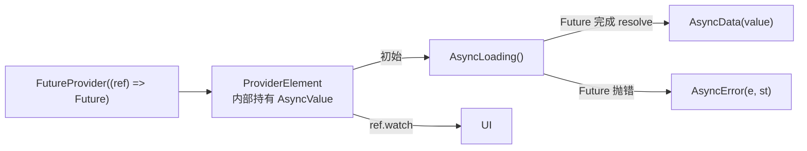

# 第 4 章 FutureProvider 与 AsyncValue

## 问题引入

你要从网络拉用户信息。用 `setState` + `Future` 写法要管 3 个字段：

```dart
bool _loading = false;
User? _user;
Object? _error;
```

每次请求开头 / 成功 / 失败都要 `setState` 调整 3 个字段，非常啰嗦。

Riverpod 把这件事标准化为一个类型：**`AsyncValue<T>`**，并提供 **`FutureProvider<T>`** 自动填充它。

## AsyncValue<T>：三态的 sealed union

```dart
sealed class AsyncValue<T> {
  // 三个实现：
  // AsyncData<T>(value)
  // AsyncError<T>(error, stackTrace)
  // AsyncLoading<T>()
}
```

一个 `AsyncValue<T>` 不是 T，是"T 的三态中之一"。Dart 3 的 switch 模式匹配让处理它非常优雅。

## 最小 FutureProvider

```dart
final userProvider = FutureProvider<User>((ref) async {
  final resp = await Dio().get('https://api.example.com/me');
  return User.fromJson(resp.data);
});
```

UI 里：

```dart
class UserPage extends ConsumerWidget {
  @override
  Widget build(BuildContext context, WidgetRef ref) {
    final user = ref.watch(userProvider);

    return switch (user) {
      AsyncData(:final value) => Text('你好, ${value.name}'),
      AsyncError(:final error) => Text('出错: $error'),
      _ => const CircularProgressIndicator(),
    };
  }
}
```

这就是 **Riverpod 处理异步的标准姿势**。不需要 3 个字段、不需要 `FutureBuilder`、不需要 `try/catch` 洒到 UI 里。

## AsyncValue 的三种用法

### 1. Dart 3 switch 模式（推荐）

```dart
return switch (value) {
  AsyncData(:final value) => Text('data=$value'),
  AsyncError(:final error, :final stackTrace) => Text('error=$error'),
  AsyncLoading() => const CircularProgressIndicator(),
};
```

### 2. `.when(...)` 回调风格

```dart
return value.when(
  data: (v) => Text('data=$v'),
  loading: () => const CircularProgressIndicator(),
  error: (e, st) => Text('error=$e'),
);
```

### 3. `.whenOrNull(...)` + 默认

```dart
return value.whenOrNull(
  data: (v) => Text(v.toString()),
) ?? const CircularProgressIndicator();
```

三种写法功能等价，**推荐新代码用 switch 模式**（编译期穷尽性检查，漏处理一种会报错）。

## 刷新和重试

```dart
// 方式 1：invalidate——标记为失效, 下次 watch 时重跑
ref.invalidate(userProvider);

// 方式 2：refresh——立即重跑, 并返回新的 Future
final fresh = ref.refresh(userProvider.future); // Future<User>
```

典型的下拉刷新：

```dart
RefreshIndicator(
  onRefresh: () async {
    ref.invalidate(userProvider);
    // 等新的请求完成再收起刷新条
    await ref.read(userProvider.future);
  },
  child: ...,
)
```

注意 `ref.read(userProvider.future)` 是拿到"里面的 Future"，配合 `await` 可以显式等它完成。

## 错误 + 数据并存：.hasValue / .value

请求正在重试时，你可能想"显示旧数据 + 顶上转一个小圈"而不是整个页面白屏。`AsyncValue` 支持这种模式：

```dart
final v = ref.watch(userProvider);
return Stack(children: [
  if (v.value != null) UserView(v.value!),
  if (v.isLoading) const LinearProgressIndicator(),
  if (v.hasError) Text('${v.error}'),
]);
```

原理：**`invalidate` 或 `refresh` 的时候，AsyncValue 可以处于"加载中但保留着上一次的值"的状态**，方便做"无白屏刷新"。

相关 API：
- `v.isLoading` / `v.hasError` / `v.hasValue`
- `v.value`（`T?`）
- `v.requireValue`（断言 `hasValue`，否则抛异常）

## 常见坑

1. **把 Future 塞进 Notifier**

    ```dart
    class Bad extends Notifier<Future<User>> {  // ❌ 别这么写
      @override
      Future<User> build() => fetch();
    }
    ```

    **改用 `AsyncNotifier`**（下一章）。

2. **自己处理 loading 状态**

    ```dart
    return user.data == null
        ? const CircularProgressIndicator()
        : Text(user.data.name);  // ❌ 忘了 error 分支
    ```

    **用 switch / when，编译器帮你穷尽检查**。

3. **`ref.refresh` 的返回值是 AsyncValue 还是 Future？**

    ```dart
    ref.refresh(userProvider);              // 返回 AsyncValue<User> (新值)
    ref.refresh(userProvider.future);       // 返回 Future<User>
    ```

## 原理一眼



**你只写了一个 `async` 函数**，剩下的三态转换是 Riverpod 自动完成的。

## 练习

1. 写一个 `randomQuoteProvider`，返回一个 `Future<String>`，800ms 后给一个随机的名言。页面打开时显示 loading，数据来后换成文字。
2. 给它加一个"刷新"按钮，点了以后重新跑一次。
3. 让函数有 20% 概率抛错，观察 error 分支是不是生效。

下一章：能"主动刷新 / 修改"的异步状态 → [第 5 章 AsyncNotifier](05_async_notifier.md)。
