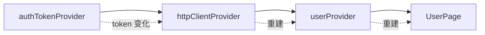
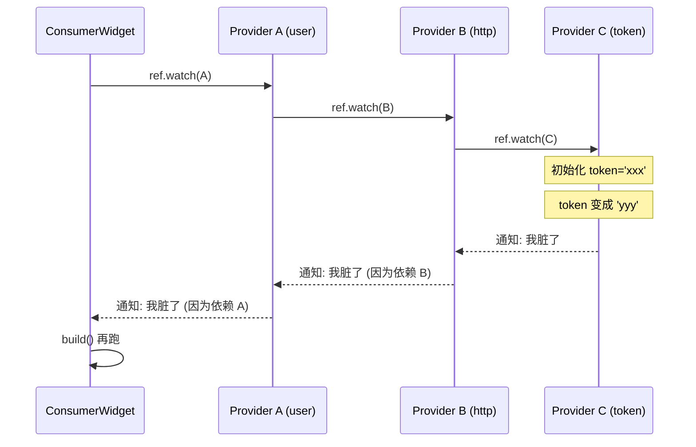

# 第 7 章 依赖组合与 family 带参数

## 问题引入

前面的 Provider 都是"独立的数据"。真实业务中 Provider 之间常常有依赖：
- `currentUserProvider` 依赖 `authTokenProvider`
- `postsProvider(userId)` 要接收一个用户 id 参数

本章讲这两件事：**Provider 互相依赖** 和 **带参数的 Provider (family)**。

## Provider 互相 `ref.watch`

Provider 的工厂函数拿到 `ref`，可以用 `ref.watch` 读别的 Provider：

```dart
final authTokenProvider = Provider<String>((ref) => 'fake-token');

final httpClientProvider = Provider<Dio>((ref) {
  final token = ref.watch(authTokenProvider);
  return Dio()..options.headers['Authorization'] = 'Bearer $token';
});

final userProvider = FutureProvider<User>((ref) async {
  final client = ref.watch(httpClientProvider);
  final resp = await client.get('/me');
  return User.fromJson(resp.data);
});
```

**关键性质**：`ref.watch` 在 Provider 内部建立**响应式依赖边**。一旦 `authTokenProvider` 变化：
1. `httpClientProvider` 被标记为脏，下次 watch 时重建（`Dio` 新的 header）
2. `userProvider` 也跟着重建（重新发起请求）
3. 所有 `ref.watch(userProvider)` 的 Widget 自动重建

这就是 Riverpod 的"响应式自动传播"。



## ref.read 在 Provider 内部——能用，但一般别用

```dart
final xProvider = Provider<String>((ref) {
  final token = ref.read(authTokenProvider);  // 不订阅
  return token;
});
```

问题：**`authTokenProvider` 变化后 `xProvider` 不会自动更新**。

**除非**你确定这个值一辈子不变（比如启动时写死的配置），否则都用 `ref.watch`。

## family：给 Provider 传参数

想要 `getPostsByUserId(userId)` 这种？用 `.family`：

```dart
final postsProvider = FutureProvider.family<List<Post>, String>((ref, userId) async {
  final client = ref.watch(httpClientProvider);
  final resp = await client.get('/users/$userId/posts');
  return (resp.data as List).map(Post.fromJson).toList();
});

// 使用
final posts = ref.watch(postsProvider('user-123'));
```

**两个泛型参数**：
1. 第一个 `List<Post>`：返回值类型
2. 第二个 `String`：参数类型

调用 `postsProvider('user-123')` 返回一个新的"具体 Provider"。**同一个参数值 → 同一个 Provider 实例 → 同一个缓存值**。

## family + 多参数：打包成 Record

family 只能接**一个**参数。多个参数用 Record（Dart 3 特性）：

```dart
typedef SearchArgs = ({String keyword, int page});

final searchProvider = FutureProvider.family<List<Item>, SearchArgs>(
  (ref, args) async {
    return await _api.search(args.keyword, args.page);
  },
);

// 使用
ref.watch(searchProvider((keyword: 'flutter', page: 1)));
```

**Record 的好处**：
- 可以有命名字段，调用方清晰
- Dart 自动实现值相等（`==` 按字段比较），**同样的 keyword + page 会命中同一个缓存**

## NotifierProvider.family / AsyncNotifierProvider.family

Notifier 版本略啰嗦：要继承 `FamilyNotifier` / `FamilyAsyncNotifier`，`build` 里通过 `arg` 拿参数：

```dart
class PostNotifier extends FamilyAsyncNotifier<Post, String> {
  @override
  Future<Post> build(String id) async {
    return await _api.getPost(id);
  }

  Future<void> edit(String newTitle) async {
    state = await AsyncValue.guard(() async {
      await _api.updatePost(arg, title: newTitle); // arg 是当前 family 参数
      return (state.value!).copyWith(title: newTitle);
    });
  }
}

final postProvider =
    AsyncNotifierProviderFamily<PostNotifier, Post, String>(PostNotifier.new);
```

> 在 **codegen** 里这些都自动生成，看起来更简洁（第 9 章会对照看）。

## family 的缓存和 autoDispose

默认情况下，`postsProvider('a')` 和 `postsProvider('b')` 是**两个独立的 Provider 实例**，都会被缓存。如果你的参数空间很大（比如用户 ID 有几千个），会导致内存暴涨。

解决方案 = `.autoDispose`（下章详讲）：

```dart
final postProvider = FutureProvider.autoDispose.family<Post, String>(
  (ref, id) async => _api.getPost(id),
);
```

当没有 Widget 在 watch 它时，这个特定参数的 Provider 会被自动释放。

## select + family：进一步优化

```dart
// 只关心某个 Post 的 title 是否变了
final postTitle = ref.watch(
  postProvider('p-1').select((p) => p.title),
);
```

## 常见坑

1. **family 参数要支持 `==`**：传自定义类时必须正确重写 `==` 和 `hashCode`，否则每次调用都是新 Provider。用 Record / freezed 可避免这个问题。

2. **在 `build` 里互 watch 导致循环依赖**：A watch B，B 又 watch A → Riverpod 会抛 `CircularDependencyError`。发现这种情况要重新设计依赖关系。

3. **用 `ref.read` 代替 `ref.watch`**：少订阅一个依赖，数据不更新。规则：**能 watch 就 watch**，只有在回调里才 read。

## 原理图：依赖自动传播



## 练习

1. 用两个 Provider 模拟 "语言设置 + 翻译函数"：`langProvider` 返回当前语言（`'zh'`/`'en'`），`translateProvider` 依赖它返回不同的字典。切换语言观察 UI 自动变化。
2. 写 `weatherProvider = FutureProvider.family<Weather, String>((ref, city) => ...)`，用 Dropdown 切换城市。
3. 把练习 2 改为多参数（city + unit）用 Record 传参。

下一章：`autoDispose` 究竟什么时候销毁 → [第 8 章](08_autodispose_lifecycle.md)。
