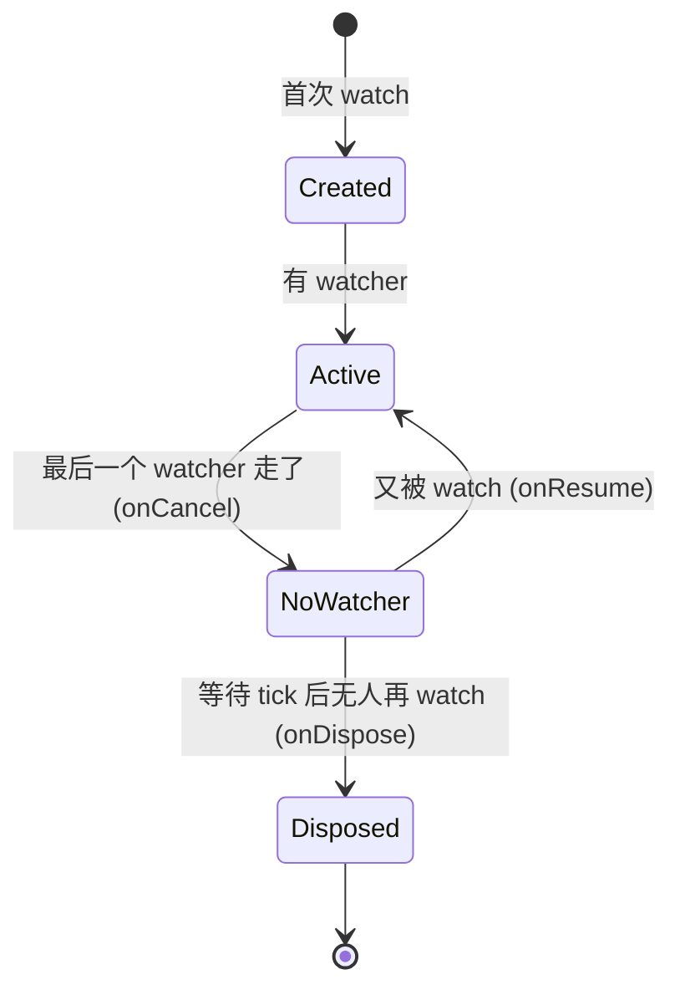

# 第 8 章 autoDispose 与生命周期

## 问题引入

默认 Provider **一旦建立就活到 App 退出**。如果有几百个 family 参数，每个都缓存不释放，内存会炸。

`.autoDispose` 的作用：**当没有任何 Widget 在 `watch` 它时，自动销毁**。

## 最简单的 autoDispose

```dart
final postProvider = FutureProvider.autoDispose.family<Post, String>(
  (ref, id) async => _api.getPost(id),
);
```

语义：
- 某页面 `ref.watch(postProvider('p-1'))` → 创建、请求、缓存
- 页面销毁（pop）→ 没有 watcher 了 → Provider 销毁 → 缓存释放
- 再进来 → 重新创建、重新请求

## 生命周期钩子

Provider 的工厂函数里，`ref` 提供了几个钩子：

```dart
final xProvider = Provider.autoDispose((ref) {
  print('build: 创建中');

  ref.onDispose(() {
    print('onDispose: 销毁了 (释放资源)');
  });

  ref.onCancel(() {
    print('onCancel: 最后一个 listener 退订 (但还没真正销毁)');
  });

  ref.onResume(() {
    print('onResume: 又有新 listener 了 (取消销毁)');
  });

  return 'hello';
});
```

顺序：
1. 首次 watch → `build`
2. 最后一个 watcher 消失 → `onCancel` 立即触发
3. 如果在一小段延迟（通常 next frame）内有新 watcher 回来 → `onResume`（跳过销毁）
4. 如果没人回来 → `onDispose` 真正销毁

**最常用的是 `onDispose`**：关闭 `StreamController`、取消 `Timer`、关闭 WebSocket…

```dart
final wsProvider = StreamProvider.autoDispose((ref) {
  final channel = WebSocketChannel.connect(...);
  ref.onDispose(() => channel.sink.close());
  return channel.stream;
});
```

## keepAlive：例外场景下不销毁

有时某个 Provider 默认 autoDispose，但**某次请求的结果贵**，不想用户切走再回来就重刷。用 `ref.keepAlive()`：

```dart
final expensiveProvider = FutureProvider.autoDispose<Big>((ref) async {
  final data = await _fetchHuge();
  final link = ref.keepAlive(); // 结果到手了, 别销毁
  ref.onDispose(() {
    // 如果之后想手动释放: link.close();
  });
  return data;
});
```

`keepAlive()` 返回的 `KeepAliveLink` 可以在之后的某个时刻调用 `.close()` 来解除保活。

常见模式："请求成功后 keepAlive，请求失败时让它自动销毁，这样下次进来会重试"：

```dart
final result = await _api.call();
ref.keepAlive(); // 只有成功才 keepAlive
return result;
```

## 不是所有 Provider 都该 autoDispose

| 场景 | 推荐 |
|-----|------|
| 登录态、全局设置 | **不要** autoDispose（App 全程都要） |
| 页面私有的 ViewModel / 详情页数据 | autoDispose |
| 列表某一项（family） | autoDispose（参数空间大） |
| 全局唯一的 Repository 单例 | 不 autoDispose |

## 手动失效：ref.invalidate / ref.invalidateSelf

```dart
// 在 Provider 内部
final xProvider = Provider((ref) {
  // 每 10 秒自动失效重算一次
  final timer = Timer.periodic(const Duration(seconds: 10), (_) {
    ref.invalidateSelf();
  });
  ref.onDispose(timer.cancel);
  return DateTime.now();
});

// 外部
ref.invalidate(postProvider('p-1'));
```

## onDispose vs onCancel：为什么要分

想象一个搜索建议列表：用户输入"fl"搜索 → 切到"flu" → 切到"flut"...

每次输入都会让上一个 family (`keyword: 'fl'`) 变成"无 watcher 状态"，但**可能很快又被 watch 回来**（用户按了退格）。

- 立即销毁：切换很慢、冷启动（浪费）
- 保留：内存吃紧

Riverpod 的折中：
- `onCancel`：最后一个 watcher 走了 → 触发（可用于记录日志、标记"可能要销毁"）
- 等一小段（通常一个事件循环 tick）
- 若没回来 → `onDispose` 销毁
- 若回来了 → `onResume`

你一般只需要用 `onDispose` 释放资源。

## family + autoDispose 的配合

```dart
final userCacheProvider =
    FutureProvider.autoDispose.family<User, String>((ref, id) async {
  final link = ref.keepAlive();  // 进来就 keepAlive
  Timer(const Duration(minutes: 5), link.close); // 5 分钟后解除保活
  return await _api.getUser(id);
});
```

经典模式：**带 TTL 的缓存**。请求成功后 keepAlive + 定时 close = 5 分钟过期。

## 常见坑

1. **autoDispose 忘记清理资源**：用了 `.autoDispose` 但没写 `ref.onDispose(timer.cancel)` → 销毁后 Timer 还在转，用户离开页面后仍然发请求。
2. **把 keepAlive 写在 try 里又在 catch 里不调 close**：失败路径也 keepAlive 了，下次进来不会重试。
3. **autoDispose 里用全局状态判定**：autoDispose 依赖 watcher 计数，和全局状态无关。不要写"if (someGlobal) dispose"。

## 原理图



## 练习

1. 本章 Demo 有一个 ChatRoom family（按房间号）。开多个房间、关掉房间，观察日志里的 build/onCancel/onDispose 顺序。
2. 把 ChatRoom 改成 `keepAlive()`，观察离开后再回来是否还是原来的状态。
3. 给某个页面用 family + Timer，关闭页面后观察 Timer 是否还在（用 onDispose 正确清理）。

下一章：把前面全部示例 **用 `@riverpod` 重写** → [第 9 章](09_codegen_riverpod.md)。
