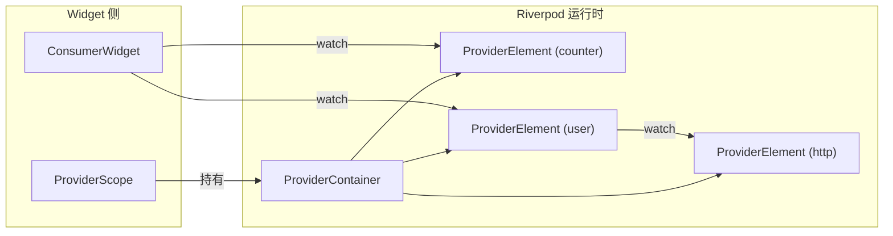
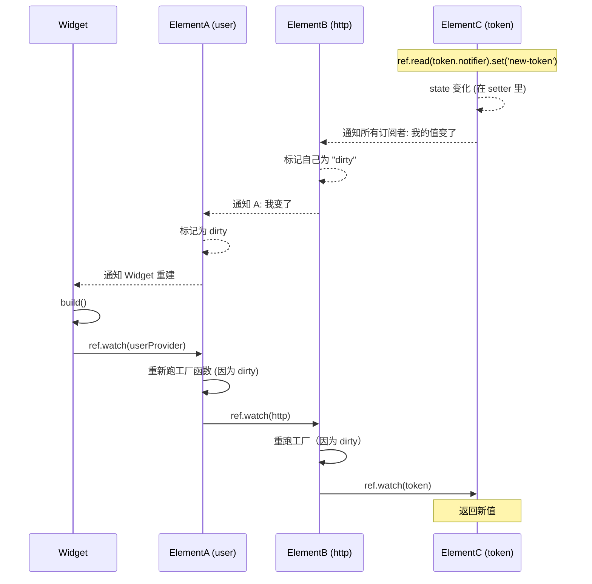

# 第 11 章 内部原理：Scope / Element / 依赖图

学到这一章，你已经能熟练用 Riverpod 了。这一章讲**它内部怎么运作的**，让你从"能用"到"吃透"。

## 三个核心对象



- **`ProviderScope`**：Widget，Riverpod 的 "根"。内部创建并持有一个 `ProviderContainer`，通过 `InheritedWidget` 把它传下去。
- **`ProviderContainer`**：真正的运行时。里面有一张 `Map<Provider, ProviderElement>`。
- **`ProviderElement`**：**每个 Provider 在 Container 里的运行时实例**。它才是"状态的家"。Provider 对象本身只是"定义/键"。

一句话总结：**Provider = 定义（就像类），ProviderElement = 实例（就像对象），ProviderContainer = 实例的集合**。

## 依赖图是怎么建起来的

当一个 Widget `ref.watch(userProvider)`：

1. WidgetRef 从最近的 `ProviderScope` 拿到 `ProviderContainer`
2. Container 查 map：有没有 `userProvider` 对应的 Element？
   - 没有 → 创建一个，调用 Provider 的工厂函数
   - 有 → 直接返回已有 Element
3. 工厂函数里又 `ref.watch(httpClientProvider)` → 递归
4. Element B (user) 记录"我依赖 Element C (http)"；同时 C 记录"我被 B 依赖"
5. Widget 也被记作 "依赖 Element B"

建完之后：
- 每个 Element 知道 "我被谁依赖" (`subscribers`)
- 每个 Element 知道 "我依赖谁" (`dependencies`)

这就是一张双向图。

## 一个 Provider 变了，链式重建是怎么发生的



**关键点**：
1. 变化从**源头 Provider**（token）往外传播
2. 每个下游 Provider 被标记 dirty，但**不立即重跑**（保持懒惰）
3. 当有 Widget / 其他 Provider 再次 watch 它（包括 build 的内部 watch）时，才真正重跑
4. 没有订阅者的 Provider 不会被重算（性能）

这个模型的两个精髓：
- **响应式自动传播**：不用手写"listener 链"
- **懒惰计算**：没人要的值不计算

## ProviderElement 里大概存什么

概念上（真实类更复杂）：

```dart
class ProviderElement<T> {
  late T _state;                              // 当前值
  bool _dirty = false;                        // 是否需要重算
  final Set<ProviderElement> _dependencies = {}; // 我依赖谁
  final Set<Listener> _listeners = {};         // 谁在听我
  final List<void Function()> _disposeCallbacks = [];

  T read() {
    if (_dirty) _rebuild();
    return _state;
  }

  void _markDirty() {
    _dirty = true;
    // 通知所有 listener (可能是下游 Element 或 Widget)
    for (final l in _listeners) l.onChange();
  }
}
```

`ref.onDispose` 就是把回调塞进 `_disposeCallbacks`；Element 销毁时遍历执行。

## ProviderScope 可以嵌套

```dart
ProviderScope(
  overrides: [themeProvider.overrideWithValue(Themes.dark)],
  child: MaterialApp(
    home: ProviderScope(
      // 内层再套一个，可以再 override 某些 Provider，仅对子树生效
      overrides: [authProvider.overrideWith(...)],
      child: const HomePage(),
    ),
  ),
);
```

**override 的作用范围是"从当前 Scope 开始往下"**：
- 内层 Scope 里 watch 某 Provider 会先找自己有没有 override，再往上找父 Scope，最后默认实现
- 这就是"作用域隔离"的本质

典型使用：
- 多租户 App：根 Scope 注入通用设置，用户登录后嵌套一个 Scope 注入"当前用户的 Repository"
- Modal 弹窗：只在弹窗里 override 某个 Provider

## 为什么 Provider 定义成顶层变量安全

再回答一次这个"看起来全局"的疑问。因为：

- `final xProvider = Provider(...)` —— `xProvider` 是一个**不可变对象**，全程唯一。它只是一把"钥匙"。
- 真正的"状态"藏在对应 `ProviderContainer` 内部的 `ProviderElement` 里。
- 不同测试可以创建不同 `ProviderContainer`，**同一把钥匙 + 不同容器 = 不同状态**。天然隔离。

## 一些 Riverpod 3 的新变化

- 统一了 `Ref` 类型（老版本是 `AutoDisposeRef` / `FamilyRef` 等多种）
- `StateProvider` / `StateNotifier` 被标记 legacy（建议用 `Notifier`）
- `@riverpod` 生成的 Provider 默认 `autoDispose`
- 支持 stateful hot reload（改 Notifier 不会丢状态）

## 实用技巧：观察 Provider 生命周期

全局挂一个 `ProviderObserver` 可以看 App 里每个 Provider 的 build / update / dispose：

```dart
class Obs extends ProviderObserver {
  @override
  void didAddProvider(ProviderBase p, Object? value, ProviderContainer c) =>
      print('add: $p = $value');
  @override
  void didUpdateProvider(ProviderBase p, Object? prev, Object? next, ProviderContainer c) =>
      print('update: $p $prev → $next');
  @override
  void didDisposeProvider(ProviderBase p, ProviderContainer c) =>
      print('dispose: $p');
}

void main() {
  runApp(ProviderScope(observers: [Obs()], child: const MyApp()));
}
```

本章 Demo 页里就挂了一个类似的 observer，把事件实时打到屏幕。

## 练习

1. 打开本章 Demo，切换几个计数器的值，观察 observer 日志的顺序。
2. 嵌套两个 ProviderScope，在内层 override 一个 Provider，确认外层不受影响。
3. 给一个 Provider 故意让它依赖自己（或环）：观察 `CircularDependencyError` 的报错文案。

下一章：**怎么在真实项目里把 Provider 分层** → [第 12 章](12_architecture_layering.md)。
