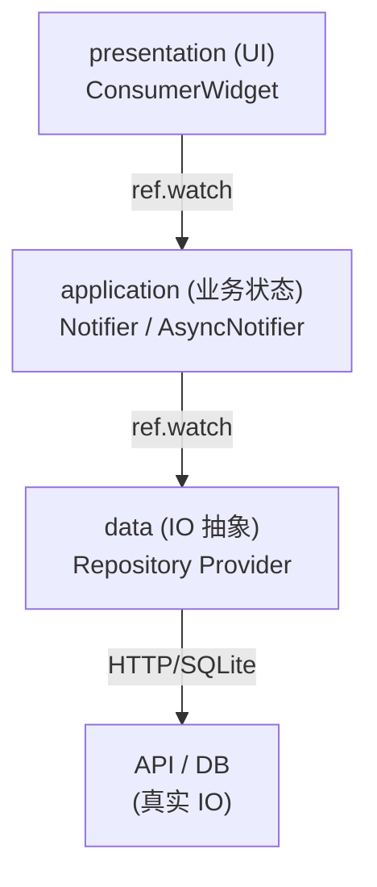
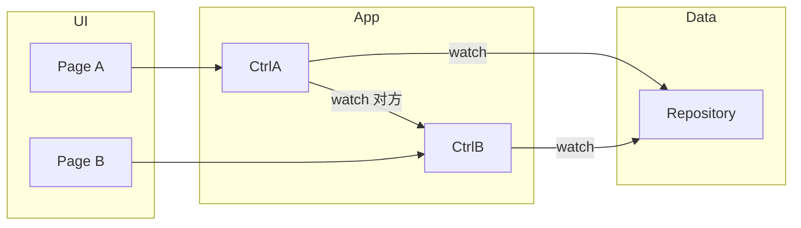

# 第 12 章 架构分层：data / application / presentation

## 为什么要分层

把一切塞在一个大 Notifier 里，短期快，长期烂：
- 测试难（要 mock 网络层）
- 换 API 或加缓存，业务代码全改
- 多个页面共享同一份数据时，复用成本高

Riverpod 推荐的分层：



每一层**只依赖下一层**，上层不知道更下层的细节。

## 三层的职责

### 1. data（数据层）

只做 **IO + 数据模型**：

```dart
// data/todo_repository.dart
abstract class TodoRepository {
  Future<List<Todo>> fetchAll();
  Future<Todo> create(String title);
  Future<void> remove(String id);
}

class HttpTodoRepository implements TodoRepository {
  HttpTodoRepository(this._client);
  final HttpClient _client;

  @override
  Future<List<Todo>> fetchAll() async { ... }
  // ...
}

// Provider: 注入真实实现
final todoRepositoryProvider = Provider<TodoRepository>((ref) {
  final client = ref.watch(httpClientProvider);
  return HttpTodoRepository(client);
});
```

**要点**：
- **接口 + 实现** 分开（为了测试能换 FakeRepository）
- Repository 只暴露 `Future<X>` / `Stream<X>`，**不要**返回 `AsyncValue<X>`（那是上层的事）
- 不要在 Repository 里读另一个 Provider 的 state，保持纯粹

### 2. application（业务状态层）

把 Repository 的数据"包装成可观察的状态"、加业务逻辑（错误重试、缓存失效、权限校验）：

```dart
// application/todos_controller.dart
class TodosController extends AsyncNotifier<List<Todo>> {
  late TodoRepository _repo;

  @override
  Future<List<Todo>> build() async {
    _repo = ref.watch(todoRepositoryProvider);
    return _repo.fetchAll();
  }

  Future<void> add(String title) async {
    state = await AsyncValue.guard(() async {
      final t = await _repo.create(title);
      return [...?state.value, t];
    });
  }

  Future<void> remove(String id) async {
    state = AsyncData(
      (state.value ?? []).where((t) => t.id != id).toList(),
    );
    try {
      await _repo.remove(id);
    } catch (e) {
      // 回滚、统一错误处理、上报……
    }
  }
}

final todosControllerProvider =
    AsyncNotifierProvider<TodosController, List<Todo>>(TodosController.new);
```

**要点**：
- 这一层**可以** `ref.watch` data 层，也**可以**被 UI 层 watch
- 所有"业务决策"都在这里（什么时候乐观更新、怎么处理失败、要不要轮询）
- **不要**碰 `BuildContext`、`Navigator`、`SnackBar`——那些是 UI 层的事

### 3. presentation（UI 层）

纯 UI：

```dart
class TodoListPage extends ConsumerWidget {
  @override
  Widget build(BuildContext context, WidgetRef ref) {
    final todos = ref.watch(todosControllerProvider);
    return Scaffold(
      body: switch (todos) {
        AsyncData(:final value) => ListView(...),
        _ => const CircularProgressIndicator(),
      },
      floatingActionButton: FloatingActionButton(
        onPressed: () =>
            ref.read(todosControllerProvider.notifier).add('New'),
      ),
    );
  }
}
```

**要点**：
- UI 层只 `watch` application 层，**不直接读 data 层**（除非某些展示型 Repository，比如 "当前主题色"）
- 副作用（导航、弹 SnackBar）用 `ref.listen` 在 `build` 里挂

## 环境切换：根部 override

开发 / 测试 / 生产用不同实现：

```dart
void main() {
  runApp(
    ProviderScope(
      overrides: [
        // 本地 mock 数据
        if (const bool.fromEnvironment('MOCK'))
          todoRepositoryProvider
              .overrideWithValue(InMemoryTodoRepository()),
      ],
      child: const MyApp(),
    ),
  );
}
```

测试：

```dart
testWidgets('展示 mock todos', (tester) async {
  await tester.pumpWidget(ProviderScope(
    overrides: [
      todoRepositoryProvider.overrideWithValue(FakeTodoRepository([
        const Todo(id: '1', title: 'test'),
      ])),
    ],
    child: const MyApp(),
  ));

  await tester.pumpAndSettle();
  expect(find.text('test'), findsOneWidget);
});
```

## 跨层通信 vs 上下层通信



Controller 之间**可以**互相 watch（比如 `UserOrderController` 依赖 `AuthController`）。不要让 Page 之间互相 watch（那说明你状态没提上去）。

## 命名建议

| 层 | 文件名 | 类名 | Provider 名 |
|----|-------|------|-------------|
| data | `todo_repository.dart` | `HttpTodoRepository` / `TodoRepository` | `todoRepositoryProvider` |
| application | `todos_controller.dart` | `TodosController` | `todosControllerProvider` |
| presentation | `todo_list_page.dart` | `TodoListPage` | — |

codegen 版命名更简洁，因为 `@riverpod class Todos` 自动变成 `todosProvider`。

## 错误处理统一

推荐在 application 层：
- 把所有异常包成一个 `AppError` 类（typed error）
- Controller 的方法 catch + rethrow `AppError`
- UI 用 `ref.listen(someCtrlProvider, (prev, next) { if (next.error is AppError) showSnack(...) })` 统一展示

不要在 UI 层到处 `try/catch`。

## 本章 Demo

Demo 页面展示了一个极简的三层实现：
- `data/settings_repository.dart` —— 一个假 Repository
- `application/theme_controller.dart` —— 读 Repository + 暴露"改主题色"方法
- UI —— 通过 controller 切换颜色

观察：UI 完全不知道 Repository 的存在。

## 练习

1. 把第 5 章的 Todo Demo 按三层重构：新建 `data/todo_repository.dart`、`application/todos_controller.dart`、UI 一个文件。原代码行数会略增，但可测性大大提升。
2. 给它写测试：mock Repository 的 `fetchAll` 返回固定列表，验证 Controller 初始化后状态正确。
3. 实现"离线兜底": Repository 包装"先读缓存、再请求、成功后更新缓存"——而 Controller 完全不需要改。

**下一章就是按这个架构来做综合实战** → [第 13 章 Todo App](13_project_todo_app.md)。
