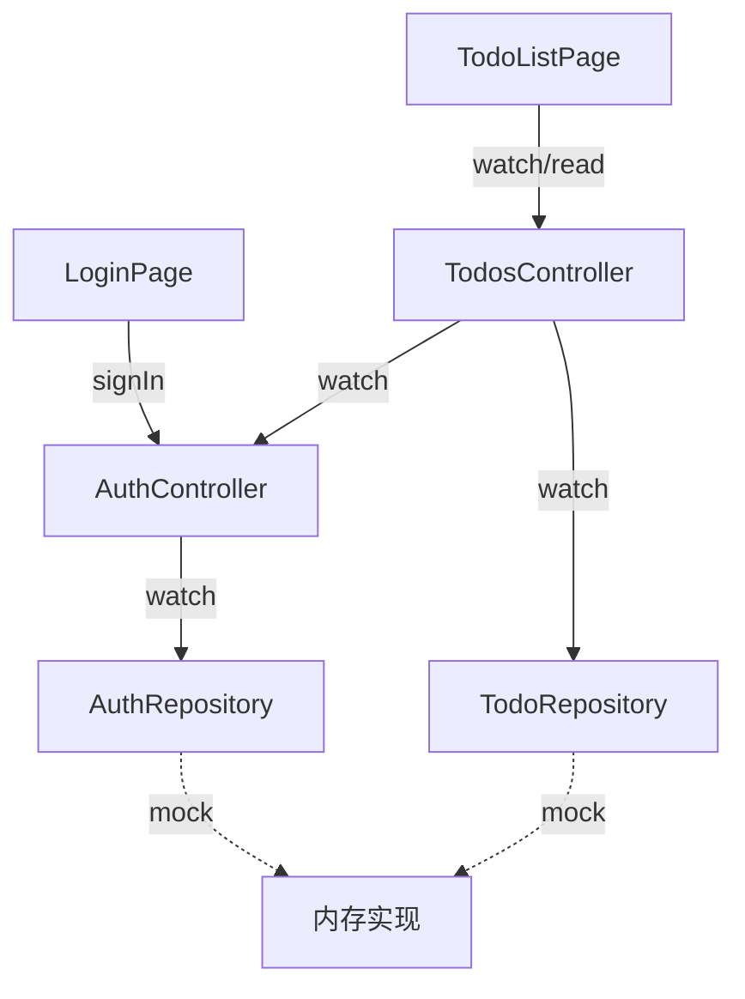

# 第 13 章 综合实战：Todo App

## 目标

把前 12 章学到的全部用上，做一个**完整的 Todo 应用**：

- **登录态** —— 未登录看登录页、登录后看 Todo 列表
- **分页列表** —— 下拉刷新、上拉加载更多
- **CRUD + 乐观更新**
- **离线缓存** —— 内存 + 本地简易 store（这里用 `SharedPreferences` 模拟思路；Demo 用内存以避免额外依赖）
- **统一错误提示** —— SnackBar
- **Widget 测试 + 单元测试**

代码组织按第 12 章的三层架构：

```
lib/project/
  model/
    todo.dart           Todo / User / Paged<T>
  data/
    auth_repository.dart
    todo_repository.dart
  application/
    auth_controller.dart
    todos_controller.dart
  presentation/
    app.dart            Project 入口 (挂到 chapter_13_page)
    login_page.dart
    todo_list_page.dart
```

## 数据流



**关键点**：
- `TodosController.build()` 里 `ref.watch(authControllerProvider)`：**未登录时自动把状态切到空列表**
- 退出登录 → `AuthController` 状态变 → `TodosController` 自动 rebuild（不用手动清 Todo）

## 登录态管理（AuthController）

```dart
sealed class AuthState {
  const AuthState();
}
class Unauthenticated extends AuthState { const Unauthenticated(); }
class Authenticated extends AuthState {
  const Authenticated(this.user);
  final User user;
}

class AuthController extends AsyncNotifier<AuthState> {
  late AuthRepository _repo;

  @override
  Future<AuthState> build() async {
    _repo = ref.watch(authRepositoryProvider);
    return _repo.restore() ?? const Unauthenticated();
  }

  Future<void> signIn(String email, String password) async {
    state = const AsyncLoading();
    state = await AsyncValue.guard(() async {
      final user = await _repo.signIn(email, password);
      return Authenticated(user);
    });
  }

  Future<void> signOut() async {
    await _repo.signOut();
    state = const AsyncData(Unauthenticated());
  }
}
```

## 分页（Paged<T>）

```dart
class Paged<T> {
  const Paged({required this.items, required this.page, required this.hasMore});
  final List<T> items;
  final int page;
  final bool hasMore;
}

class TodosController extends AsyncNotifier<Paged<Todo>> {
  static const pageSize = 10;

  @override
  Future<Paged<Todo>> build() async {
    final auth = ref.watch(authControllerProvider).value;
    if (auth is! Authenticated) {
      return const Paged(items: [], page: 0, hasMore: false);
    }
    final repo = ref.watch(todoRepositoryProvider);
    final list = await repo.fetchPage(auth.user.id, page: 1, size: pageSize);
    return Paged(items: list, page: 1, hasMore: list.length == pageSize);
  }

  Future<void> loadMore() async {
    final cur = state.value;
    if (cur == null || !cur.hasMore) return;
    final auth = ref.read(authControllerProvider).value;
    if (auth is! Authenticated) return;
    final repo = ref.read(todoRepositoryProvider);

    final nextPage = cur.page + 1;
    final more = await repo.fetchPage(auth.user.id, page: nextPage, size: pageSize);
    state = AsyncData(Paged(
      items: [...cur.items, ...more],
      page: nextPage,
      hasMore: more.length == pageSize,
    ));
  }

  Future<void> refresh() async {
    ref.invalidateSelf();
    await future; // 等初始加载完成
  }

  // CRUD（乐观更新）...
}
```

## 离线缓存（思路）

**`FakeTodoRepository` 内部同时维护一个 `_cache: List<Todo>` 和一个 "远端" `_remote: List<Todo>`**：

- `fetchPage` 先返回 `_cache` 里的数据，然后异步从 `_remote` 刷新 `_cache`
- `create/update/delete` 先改 `_cache`，再写 `_remote`；失败回滚

真实项目里把 `_cache` 换成 `SharedPreferences` / `Hive` / `sqflite`，上层代码**完全不用动**。这就是分层的好处。

## 错误处理

```dart
// 在 TodoListPage 里
ref.listen<AsyncValue<Paged<Todo>>>(todosControllerProvider, (prev, next) {
  if (next.hasError && !next.isLoading) {
    ScaffoldMessenger.of(context).showSnackBar(
      SnackBar(content: Text('${next.error}')),
    );
  }
});
```

Controller 里方法失败时抛的异常全部被 `AsyncValue.guard` 转成 `AsyncError`，在 UI 层统一通过 `ref.listen` 展示。

## 测试

文件 `test/project/todos_controller_test.dart`：

```dart
test('登录后自动加载首页 10 条', () async {
  final container = ProviderContainer(overrides: [
    authRepositoryProvider.overrideWith((ref) => FakeAuthRepository()),
    todoRepositoryProvider.overrideWith((ref) => FakeTodoRepository(count: 25)),
  ]);
  addTearDown(container.dispose);

  // 登录
  await container
      .read(authControllerProvider.notifier)
      .signIn('a@b.c', 'pw');

  // 等 todosController 初始化
  final page = await container.read(todosControllerProvider.future);
  expect(page.items.length, 10);
  expect(page.hasMore, isTrue);
});
```

Widget 测试（`test/project/app_test.dart`）：通过 `ProviderScope.overrides` 注入 Fake，验证"登录→看列表→退出"流程。

## Demo 入口

把第 13 章页面挂到首页导航：`chapter_13_page.dart` 内部直接 `return const TodoApp();`（`TodoApp` 来自 `lib/project/presentation/app.dart`）。

## 学完这章之后

回头看前 12 章，你会发现综合项目里的每一行都似曾相识：
- 第 2、3 章：ref 三件套、Notifier
- 第 4、5 章：AsyncValue、AsyncNotifier、乐观更新
- 第 7 章：依赖组合（TodosController 依赖 AuthController）
- 第 8 章：autoDispose（项目里一些辅助 Provider）
- 第 10 章：override Repository 做测试
- 第 12 章：三层架构

Riverpod 的学习曲线就到这里。接下来的复杂 App 只是这些模式的组合 + 规模化。祝写代码开心。
